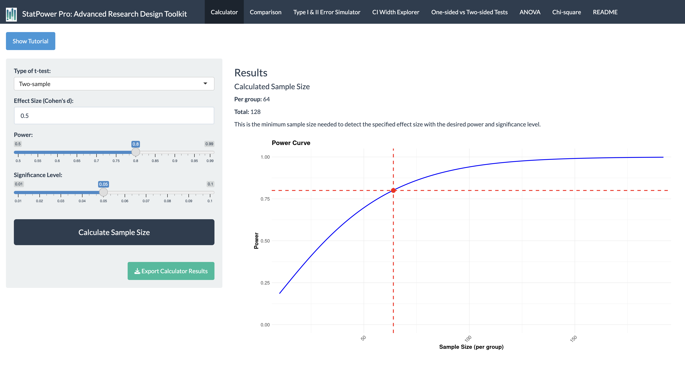
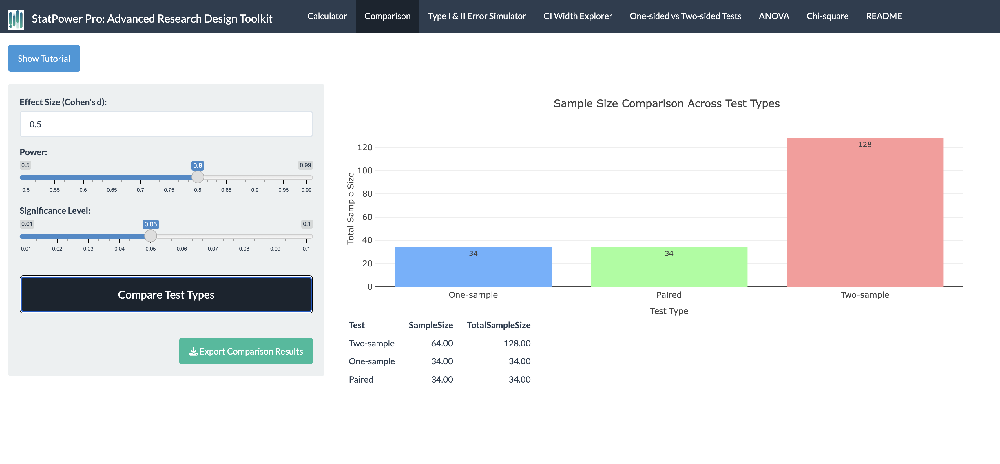
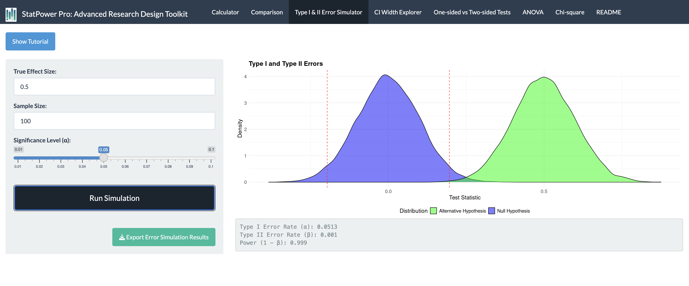
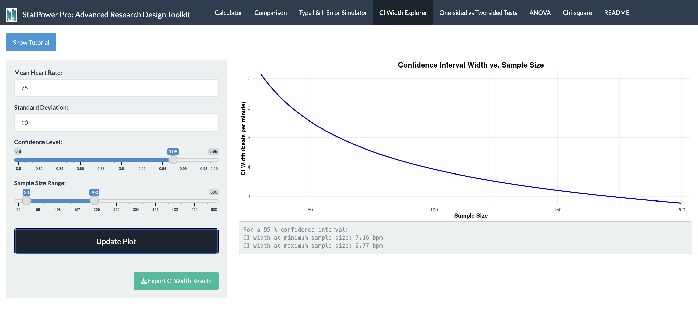
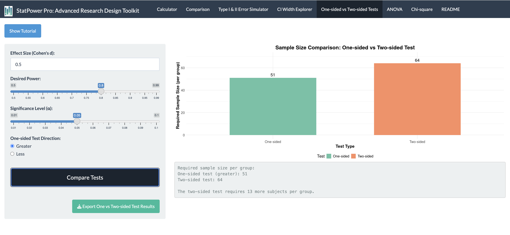
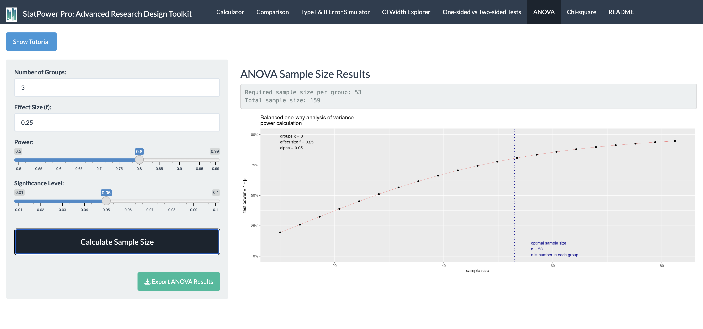
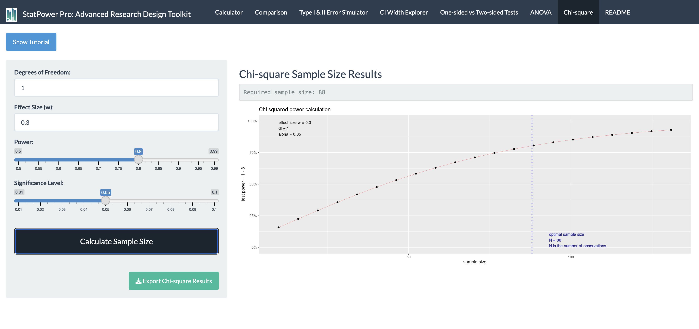

```{r setup, include=FALSE}
knitr::opts_chunk$set(echo = FALSE, message = FALSE, warning = FALSE,
                      fig.width = 8, fig.height = 6, out.width = '100%')
library(shiny)
library(ggplot2)
library(plotly)
library(pwr)
library(dplyr)
library(knitr)
library(kableExtra)
```

## Introduction

### Overview of StatPower Pro

StatPower Pro is an advanced interactive tool designed to enhance your understanding of statistical power, sample size calculation, and research design. This app will serve as a valuable resource in your journey to mastering the intricacies of biostatistics  and data science and its application in clinical research.

### Importance of Statistical Power and Sample Size in Research

In the realm of clinical research, the concepts of statistical power and sample size are paramount. They form the foundation of robust study designs and influence the validity and reliability of research findings. Understanding these concepts is crucial for several reasons:

1. **Ethical Considerations**: Proper sample size calculations ensure that studies are neither underpowered (risking false negatives) nor overpowered (unnecessarily exposing more participants to potential risks).

2. **Resource Optimization**: Accurate power analysis helps allocate resources efficiently, preventing waste in overly large studies or inadequate investment in underpowered studies.

3. **Reproducibility**: Studies with appropriate power are more likely to produce reliable, reproducible results, contributing to the overall integrity of scientific research.

4. **Publication Bias**: Understanding power can help researchers and readers critically evaluate published studies, particularly in the context of negative findings.

### Key Features of StatPower Pro

StatPower Pro encompasses seven key features, each addressing crucial aspects of statistical analysis and research design:

1. Sample Size Calculator
2. Test Type Comparison
3. Type I & II Error Simulator
4. CI Width Explorer
5. One-sided vs Two-sided Tests Comparison
6. ANOVA Calculator
7. Chi-square Calculator

This guide will provide an in-depth exploration of each feature, including theoretical background, practical applications, and tips for interpretation.

StatPower Pro is freely accessible online. You can access the app directly at:
[https://analytica.shinyapps.io/StatPower-Pro/](https://analytica.shinyapps.io/StatPower-Pro/)

We encourage you to open this link and follow along with the examples in this guide.


## 1. Sample Size Calculator

### Theoretical Background

#### Understanding Statistical Power

Statistical power is a fundamental concept in hypothesis testing. It represents the probability of correctly rejecting a false null hypothesis, or in simpler terms, the likelihood of detecting a true effect when it exists.

Mathematically, power is defined as:

Power = 1 - β

Where β is the probability of a Type II error (failing to reject a false null hypothesis).

#### Factors Influencing Statistical Power

Several interconnected factors influence statistical power:

1. **Effect Size**: The magnitude of the difference or relationship you're trying to detect. It's a measure of how substantial the effect is in the population. Effect sizes are often categorized as:
   - Small: Subtle effects that might be challenging to detect
   - Medium: Moderate effects that are typically visible to the naked eye
   - Large: Substantial effects that are obvious even in small samples

2. **Significance Level (α)**: The threshold for declaring statistical significance, typically set at 0.05. It represents the probability of a Type I error (rejecting a true null hypothesis).

3. **Sample Size**: The number of participants or observations in your study. Larger samples generally provide more power but come with increased costs and logistical challenges.

4. **Variability in the Data**: The spread or dispersion of the data. More variable data requires larger samples to achieve the same power.

### The Power-Sample Size Relationship

The relationship between power and sample size is not linear. As sample size increases, power also increases, but with diminishing returns. This relationship is crucial for understanding the trade-offs in study design.

### App Demo and Interpretation

```{r, echo=FALSE, fig.align='center'}

```

The power curve visualizes the complex relationship between sample size and statistical power:

- **Blue Line**: Represents how power increases with sample size. Note the steep increase initially, followed by a flattening of the curve.
- **Red Dashed Horizontal Line**: Indicates the conventionally desired power level of 0.8 (80% power).
- **Red Dashed Vertical Line**: Shows the required sample size to achieve 80% power.

In this example, we need approximately 64 subjects per group to achieve 0.8 power. This point on the curve is critical:

- **Below this point**: Small increases in sample size yield substantial gains in power.
- **Above this point**: We enter the realm of diminishing returns, where large increases in sample size are needed for small gains in power.

### Practical Applications and Tips

1. **Determining Minimum Sample Size**: Use the app to find the minimum sample size needed to achieve desired power (typically 0.8 or higher) for your specific effect size and significance level.

2. **Exploring Trade-offs**: Adjust the effect size, significance level, and desired power to understand how these changes impact required sample size.

3. **Feasibility Assessment**: If the calculated sample size is unfeasible, consider:
   - Using more reliable measures to reduce variability
   - Focusing on larger effect sizes (if justifiable)
   - Employing within-subjects designs when possible
   - Adjusting the desired power or significance level (with caution)

4. **Pilot Studies**: Use the app to determine appropriate sample sizes for pilot studies, which can help estimate effect sizes for larger studies.

5. **Interpreting Published Research**: Apply the app to evaluate the power of published studies, especially when interpreting null results.

### Case Study: Designing a Clinical Trial

Suppose you're planning a clinical trial to test a new hypertension medication. Based on previous studies, you expect a medium effect size (d = 0.5) in blood pressure reduction compared to a placebo.

Using StatPower Pro:
- Set effect size to 0.5
- Set desired power to 0.8
- Set significance level to 0.05
- Choose 'Two-sample' for the test type

Result: You need approximately 64 participants per group (128 total).

**Discussion Points:**
- Is this sample size feasible for your study?
- How would changing the effect size to 0.4 (smaller effect) impact the required sample size?
- What if you increased the desired power to 0.9?

Exploring these scenarios in StatPower Pro can lead to informed decisions about study design and resource allocation.

## 2. Test Type Comparison

### Theoretical Background

#### Types of t-tests

T-tests are fundamental statistical tools used to compare means. There are three main types of t-tests, each suited to different research scenarios:

1. **Two-sample t-test**: 
   - Purpose: Compares means of two independent groups
   - Example: Comparing treatment effect between a control group and an experimental group
   - Null Hypothesis: μ1 = μ2 (The means of the two groups are equal)

2. **One-sample t-test**: 
   - Purpose: Compares one group mean to a known value
   - Example: Comparing average patient recovery time to a standard recovery time
   - Null Hypothesis: μ = μ0 (The sample mean is equal to a specified value)

3. **Paired t-test**: 
   - Purpose: Compares two related means (often before and after measurements)
   - Example: Comparing pre-treatment and post-treatment scores for the same group of patients
   - Null Hypothesis: μd = 0 (The mean difference between paired observations is zero)

#### How Test Choice Affects Sample Size

The choice of test affects the required sample size due to differences in how these tests handle variability:

- **Two-sample tests** generally require the largest sample sizes because they involve two separate groups, each with its own variability.
- **One-sample tests** often need smaller samples as they compare to a fixed value, reducing one source of variability.
- **Paired tests** typically require the smallest samples because they control for individual differences, reducing within-group variability.

### App Demo and Interpretation

```{r, echo=FALSE, fig.align='center'}

```

The bar chart compares required sample sizes for different t-test types:

- **Two-sample test**: Requires the largest sample size
- **One-sample test**: Requires a smaller sample size compared to the two-sample test
- **Paired test**: Requires the smallest sample size

This visualization clearly demonstrates how the choice of test design can significantly impact the required sample size, even when all other parameters (effect size, power, significance level) remain constant.

### Practical Applications and Tips

1. **Choosing the Appropriate Test**: 
   - Base your choice on your research question and data structure, not on minimizing sample size.
   - Consider the nature of your groups (independent vs. related) and your comparison target (another group vs. a known value).

2. **Leveraging Paired Designs**: 
   - When feasible, paired designs can be more powerful and require smaller samples.
   - Useful in before-after studies or when natural pairing exists (e.g., twins, matched pairs).

3. **Reducing Variability in Two-sample Tests**: 
   - Consider strategies to reduce between-group variability, such as matching or stratification.
   - Use of covariates in analysis (ANCOVA) can also help reduce unexplained variability.

4. **Balancing Power and Practicality**: 
   - While paired tests often require smaller samples, they may not always be feasible or appropriate.
   - Consider logistics, potential for dropout, and the nature of your research question.

5. **Interpreting Published Research**: 
   - When reviewing studies, consider how the choice of test might have influenced the sample size and, consequently, the study's power.

### Case Study: Evaluating Treatment Efficacy

Scenario: You're researching the efficacy of a new pain medication. You have three potential study designs:

1. Compare pain scores of treated patients to a known average (One-sample)
2. Compare pain scores between a treatment group and a control group (Two-sample)
3. Compare pain scores before and after treatment in the same patients (Paired)

Using StatPower Pro, set:
- Effect size: 0.5 (medium effect)
- Desired power: 0.8
- Significance level: 0.05

Results:
- One-sample test: 34 participants
- Two-sample test: 64 participants per group (128 total)
- Paired test: 34 pairs (34 total)

**Discussion Points:**
- How does each design affect your total sample size?
- What are the pros and cons of each approach beyond sample size considerations?
- How might practical constraints (e.g., recruitment challenges, budget) influence your choice?

This example illustrates how StatPower Pro can inform crucial decisions in study design, balancing statistical considerations with practical constraints.

## 3. Type I & II Error Simulator

### Theoretical Background

#### Understanding Type I and Type II Errors

In hypothesis testing, two types of errors can occur:

1. **Type I Error (α)**: 
   - Definition: Rejecting the null hypothesis when it's actually true (false positive)
   - Probability: Set by the significance level, typically 0.05
   - Example: Concluding a treatment is effective when it actually isn't

2. **Type II Error (β)**: 
   - Definition: Failing to reject the null hypothesis when it's actually false (false negative)
   - Probability: 1 - Power
   - Example: Failing to detect the effectiveness of a truly beneficial treatment

#### The Relationship Between Errors and Power

- **Power = 1 - β**: The probability of correctly rejecting a false null hypothesis
- There's an inherent trade-off: decreasing one type of error often increases the other

#### Factors Influencing Error Rates

1. **Sample Size**: Larger samples generally reduce both types of errors
2. **Effect Size**: Larger effects are easier to detect, reducing Type II errors
3. **Significance Level**: Stricter levels (smaller α) reduce Type I errors but increase Type II errors
4. **Variability**: Higher variability in data increases both types of errors

### App Demo and Interpretation

```{r, echo=FALSE, fig.align='center'}

```

This visualization helps understand the interplay between Type I and II errors:

- **Blue Distribution**: Represents the null hypothesis (H0) - the distribution of test statistics if there's no effect
- **Green Distribution**: Represents the alternative hypothesis (H1) - the distribution if there is an effect
- **Red Dashed Lines**: Critical values that determine the rejection region for H0
- **Type I Error**: Area under the blue curve beyond the red lines
- **Type II Error**: Area under the green curve between the red lines

Key Observations:
- The overlap between the distributions represents the potential for errors
- Moving the red lines (changing α) affects both error types
- Separating the distributions (increasing effect size or sample size) reduces both errors

### Practical Applications and Tips

1. **Balancing Error Types**: 
   - Consider the relative costs of each error type in your research context
   - In medical studies, false negatives (missing a real effect) might be more concerning than false positives

2. **Sample Size Planning**: 
   - Use the simulator to understand how increasing sample size affects both error types
   - Find the optimal sample size that balances error reduction with practical constraints

3. **Setting Significance Levels**: 
   - Explore how different α levels affect power and Type II error rates
   - Consider using different α levels for exploratory vs. confirmatory research

4. **Effect Size Considerations**: 
   - Use the simulator to see how different effect sizes impact error rates
   - This can help in planning studies for detecting smaller, more realistic effects

5. **Understanding Power**: 
   - Visualize how power (1 - β) changes with different parameters
   - Use this understanding to justify power calculations in research proposals

### Case Study: Clinical Trial Decision Making

Scenario: You're designing a clinical trial for a new cancer treatment. The stakes are high:
- A Type I error could lead to approving an ineffective treatment (wasted resources, potential harm to patients)
- A Type II error could mean missing an effective treatment (lost opportunity to save lives)

Using StatPower Pro:
- Set effect size to 0.4 (a moderate effect for cancer treatments)
- Vary sample sizes and significance levels

**Discussion Points:**
- How does changing the significance level from 0.05 to 0.01 affect Type I and II errors?
- What sample size would you need to achieve both low Type I and Type II error rates?
- Given the high stakes, would you prioritize minimizing Type I or Type II errors? Why?

This example demonstrates how the Type I & II Error Simulator can inform critical decisions in high-stakes research, balancing statistical rigor with ethical considerations and practical constraints.

## 4. CI Width Explorer

### Theoretical Background

#### Understanding Confidence Intervals

Confidence Intervals (CI) provide a range of plausible values for a population parameter:

- Definition: A CI is a range of values that you can be confident (to a specified degree) contains the true population parameter
- Interpretation: A 95% CI means that if you repeated the study many times, 95% of the CIs would contain the true population parameter

#### Factors Influencing CI Width

1. **Sample Size**: Larger samples lead to narrower CIs
2. **Variability in the Data**: More variable data results in wider CIs
3. **Confidence Level**: Higher confidence levels (e.g., 99% vs 95%) result in wider CIs
4. **Standard Error**: CI width is directly related to the standard error of the estimate

#### Importance of CI Width

- Precision: Narrower CIs indicate more precise estimates
- Practical Significance: CI width helps interpret the practical importance of results
- Study Planning: Understanding CI width helps in determining appropriate sample sizes for desired precision

### App Demo and Interpretation

```{r, echo=FALSE, fig.align='center'}

```

The curve shows how CI width decreases as sample size increases:

- Y-axis: Represents the width of the confidence interval
- X-axis: Represents the sample size
- Curve Shape: Demonstrates an inverse relationship between sample size and CI width

Key Observations:
- Rapid decrease in CI width for small sample sizes
- The rate of decrease slows for larger sample sizes (diminishing returns)
- This relationship helps researchers balance precision with resource constraints

### Practical Applications and Tips

1. **Determining Sample Size for Desired Precision**: 
   - Use the app to find the sample size needed for a specific CI width
   - Consider the practical implications of different CI widths in your field

2. **Balancing Precision and Resources**: 
   - Identify the point of diminishing returns where increasing sample size yields minimal improvements in precision
   - Use this to justify sample size decisions in research proposals

3. **Interpreting Published Research**: 
   - Use the app to understand the precision of estimates in published studies
   - Evaluate whether the CI width in a study is narrow enough for meaningful conclusions

4. **Planning Pilot Studies**: 
   - Determine appropriate sample sizes for pilot studies to estimate parameters with reasonable precision

5. **Considering Practical Significance**: 
   - Relate CI width to clinically or practically significant differences in your field
   - Ensure that your CI is narrow enough to make meaningful inferences

### Case Study: Estimating Population Parameters

Scenario: You're conducting a study to estimate the average blood pressure in a population of patients with hypertension.

Using StatPower Pro:
- Set the confidence level to 95%
- Assume a standard deviation of 15 mmHg (based on previous studies)
- Explore different sample sizes

Results:
- n = 50: CI width ≈ 8.3 mmHg
- n = 100: CI width ≈ 5.9 mmHg
- n = 200: CI width ≈ 4.1 mmHg

**Discussion Points:**
- How precise does your estimate need to be for clinical relevance?
- At what point do increases in sample size yield diminishing returns in precision?
- How would changing the confidence level to 99% affect the CI width?

This example illustrates how the CI Width Explorer can guide decisions about sample size and precision in estimation studies.

## 5. One-sided vs Two-sided Tests

### Theoretical Background

#### Understanding One-sided and Two-sided Tests

1. **One-sided (Directional) Tests**: 
   - Hypothesis about the direction of effect (greater than or less than)
   - Example H1: μ > μ0 or μ < μ0
   - Used when there's a clear expectation about the direction of the effect

2. **Two-sided (Non-directional) Tests**: 
   - Hypothesis about any difference (not equal to)
   - Example H1: μ ≠ μ0
   - Used when the direction of the effect is uncertain or not specified

#### Power Implications

- One-sided tests generally have more power for a given sample size
- This is because all the α is allocated to one tail of the distribution in a one-sided test

#### Ethical and Practical Considerations

- One-sided tests can miss unexpected effects in the opposite direction
- The choice between one-sided and two-sided should be based on research questions and prior knowledge, not just to maximize power

### App Demo and Interpretation

```{r, echo=FALSE, fig.align='center'}

```

The comparison shows:
- Required sample size for one-sided test
- Required sample size for two-sided test
- The difference in sample size between the two approaches

Key Observations:
- One-sided tests require smaller sample sizes for the same power
- The difference in required sample size can be substantial, especially for smaller effect sizes

### Practical Applications and Tips

1. **Choosing Between One-sided and Two-sided Tests**: 
   - Use one-sided tests only when you have a strong theoretical or practical reason to expect an effect in a specific direction
   - Consider the risks of missing unexpected effects when using one-sided tests

2. **Justifying Test Choice**: 
   - Use the app to quantify the sample size implications of your test choice
   - Be prepared to justify one-sided tests in your research protocol or publication

3. **Sensitivity Analysis**: 
   - Explore how the choice between one-sided and two-sided tests affects your study's feasibility
   - Consider running analyses both ways if the choice significantly impacts your ability to conduct the study

4. **Ethical Considerations**: 
   - Discuss the ethical implications of choosing a one-sided test, especially in clinical trials
   - Consider whether a one-sided test might be viewed as "fishing for significance"

5. **Reporting Results**: 
   - If using a one-sided test, clearly state this in your methods and results
   - Consider reporting two-sided p-values alongside one-sided results for transparency

### Case Study: Testing a New Drug

Scenario: You're testing a new drug expected to lower cholesterol levels.

Using StatPower Pro:
- Set effect size to 0.3 (a modest effect)
- Set desired power to 0.8
- Set significance level to 0.05

Results:
- One-sided test: 138 participants
- Two-sided test: 176 participants

**Discussion Points:**
- Given prior research, is a one-sided test justifiable?
- How would you defend your choice of a one-sided or two-sided test to an ethics committee?
- If unexpected results emerge (e.g., the drug increases cholesterol), how would your choice of test affect your ability to detect this?

This example demonstrates how the choice between one-sided and two-sided tests involves balancing statistical power, ethical considerations, and scientific rigor.

## 6. ANOVA Calculator

### Theoretical Background

#### Understanding ANOVA (Analysis of Variance)

- Purpose: Compares means across multiple groups (three or more)
- Null Hypothesis: All group means are equal (μ1 = μ2 = μ3 = ... = μk)
- Alternative Hypothesis: At least one group mean is different

#### Factors Affecting Power in ANOVA

1. **Number of Groups**: Generally, more groups require larger total sample sizes
2. **Effect Size**: In ANOVA, often expressed as Cohen's f
   - f = 0.10 is considered a small effect
   - f = 0.25 is a medium effect
   - f = 0.40 is a large effect
3. **Significance Level**: Typically set at 0.05
4. **Desired Power**: Conventionally aimed at 0.8 or higher

#### Importance in Research Design

- Crucial for studies comparing multiple treatments or conditions
- Helps determine the sample size needed to detect differences among groups
- Informs decisions about the number of groups to include in a study

### App Demo and Interpretation

```{r, echo=FALSE, fig.align='center'}

```

The plot shows:
- X-axis: Number of groups in the ANOVA
- Y-axis: Statistical power achieved
- Curve: Relationship between number of groups and power, given fixed total sample size and effect size

Key Observations:
- Power generally increases with more groups (given fixed effect size and total sample size)
- The rate of power increase diminishes as the number of groups grows
- This relationship helps researchers balance the number of groups with achievable power

### Practical Applications and Tips

1. **Determining Sample Size**: 
   - Use the app to calculate the required sample size per group for a desired power level
   - Consider practical constraints when deciding on the number of groups

2. **Exploring Trade-offs**: 
   - Investigate how changing the number of groups affects required sample size
   - Balance the benefits of more groups (increased power) with the costs (increased complexity, resources)

3. **Effect Size Considerations**: 
   - Use the app to understand how different effect sizes impact power and sample size requirements
   - Consider running calculations for a range of plausible effect sizes

4. **Planning Multi-arm Studies**: 
   - Use the ANOVA calculator to design efficient multi-arm trials
   - Explore how adding or removing study arms affects overall power and feasibility

5. **Post-hoc Considerations**: 
   - Remember that ANOVA only tells you if there are any differences among groups
   - Plan for post-hoc tests to determine which specific groups differ

### Case Study: Comparing Multiple Treatments

Scenario: You're planning a study to compare the effectiveness of four different exercise programs on weight loss.

Using StatPower Pro:
- Set the number of groups to 4
- Assume a medium effect size (f = 0.25)
- Set desired power to 0.8
- Set significance level to 0.05

Results:
- Required sample size: 45 participants per group (180 total)

**Discussion Points:**
- How would adding a fifth group (e.g., a control group) affect your sample size requirements?
- If you can only recruit 120 participants total, how would this affect your study's power?
- How might you adjust your design if the effect size is smaller (f = 0.15)?

This example illustrates how the ANOVA Calculator can guide decisions in complex study designs, helping researchers balance statistical power with practical constraints.

## 7. Chi-square Calculator

### Theoretical Background

#### Understanding Chi-square Tests

- Purpose: Analyze categorical data and test relationships between categorical variables
- Common uses: 
  1. Test of Independence: Examines the relationship between two categorical variables
  2. Goodness of Fit Test: Compares observed frequencies to expected frequencies

#### Key Concepts in Chi-square Analysis

1. **Degrees of Freedom (df)**: Related to the number of categories in your data
   - For test of independence: df = (r-1)(c-1), where r = number of rows, c = number of columns
   - For goodness of fit: df = k-1, where k = number of categories

2. **Effect Size (w)**: Measures the magnitude of the difference between observed and expected frequencies
   - w = 0.1 is considered a small effect
   - w = 0.3 is a medium effect
   - w = 0.5 is a large effect

3. **Sample Size**: Affects the power to detect significant relationships or differences

#### Importance in Research

- Crucial for studies involving categorical outcomes
- Helps determine sample size needed to detect associations between categorical variables
- Important in fields like epidemiology, social sciences, and clinical research

### App Demo and Interpretation

```{r, echo=FALSE, fig.align='center'}

```

The plot shows:
- X-axis: Effect size (w)
- Y-axis: Required sample size
- Multiple lines: Represent different degrees of freedom

Key Observations:
- Required sample size decreases as effect size increases
- More degrees of freedom (more categories) generally require larger sample sizes
- The relationship between effect size and sample size is non-linear

### Practical Applications and Tips

1. **Sample Size Determination**: 
   - Use the app to calculate required sample size based on expected effect size and degrees of freedom
   - Consider running calculations for a range of plausible effect sizes

2. **Study Design Decisions**: 
   - Explore how different categorizations (affecting degrees of freedom) impact sample size requirements
   - Balance the desire for detailed categories with power considerations

3. **Feasibility Assessment**: 
   - Use the calculator to determine if your planned sample size is sufficient for your expected effect size
   - Adjust study design or expectations if required sample sizes are not feasible

4. **Interpreting Published Research**: 
   - Use the app to evaluate the power of published chi-square analyses, especially for non-significant results

5. **Minimum Expected Frequencies**: 
   - Remember that chi-square tests require minimum expected frequencies in each cell (typically > 5)
   - Use the app to ensure your sample size is large enough to meet this assumption

### Case Study: Analyzing Treatment Preferences

Scenario: You're studying the relationship between age groups (young, middle-aged, elderly) and preferences for three types of hypertension treatments (medication, lifestyle changes, combination).

Using StatPower Pro:
- Degrees of freedom: (3-1)(3-1) = 4
- Assume a medium effect size (w = 0.3)
- Set desired power to 0.8
- Set significance level to 0.05

Results:
- Required sample size: 133 participants

**Discussion Points:**
- How would collapsing age groups into two categories affect your sample size requirement?
- If you can only recruit 100 participants, what effect size would you be able to detect?
- How might you adjust your design if you expect a smaller effect (w = 0.2)?

This example demonstrates how the Chi-square Calculator can inform decisions in studies involving categorical data, helping researchers design adequately powered studies for detecting associations between categorical variables.

## Conclusion

### Integrating StatPower Pro in Research Design

StatPower Pro is a powerful tool that can significantly enhance your approach to research design and statistical analysis. By providing interactive visualizations and instant calculations, it allows you to:

1. Make informed decisions about sample size and study design
2. Understand the trade-offs between different statistical approaches
3. Explore the implications of various parameter choices on your study's power and precision

### Key Takeaways

1. **Power, Effect Size, and Sample Size are Interconnected**: 
   - Changing one parameter affects the others
   - Use StatPower Pro to explore these relationships in your specific research context

2. **Different Test Types Have Different Requirements**: 
   - Choose the appropriate test based on your research question and data structure
   - Understand how test choice affects sample size and power

3. **Balance Statistical and Practical Significance**: 
   - Consider both the statistical power of your study and the practical importance of the effects you're trying to detect
   - Use confidence interval widths to interpret the precision and practical significance of your results

4. **Ethical Considerations in Study Design**: 
   - Use StatPower Pro to ensure your studies are neither underpowered (risking false negatives) nor overpowered (unnecessarily exposing participants to potential risks)
   - Consider the ethical implications of your choices in test direction and sample size

5. **Flexibility in Research Planning**: 
   - Explore multiple scenarios and designs before finalizing your research plan
   - Use StatPower Pro to justify your methodological choices in research proposals and publications

### Future Directions

As you progress in your research career, continue to use tools like StatPower Pro to:

- Stay updated on best practices in statistical power and sample size determination
- Critically evaluate published research in terms of statistical power and precision
- Design more efficient and ethical studies that optimize resource use while maintaining scientific rigor

Remember, while StatPower Pro is a powerful aid in research design, it should be used in conjunction with subject matter expertise, ethical considerations, and practical constraints. The app is a tool to inform your decisions, not to make them for you.

## Accessing StatPower Pro

To start using StatPower Pro and apply the concepts discussed in this guide, visit:

[https://analytica.shinyapps.io/StatPower-Pro/](https://analytica.shinyapps.io/StatPower-Pro/)

This web-based application is free to use and does not require any installation. Simply click the link to begin exploring the powerful features of StatPower Pro in your browser.

Remember to refer back to this guide as you use the app for detailed explanations and interpretations of each feature.

## Additional Resources

For further exploration of the concepts covered in this guide:

1. Cohen, J. (1988). Statistical Power Analysis for the Behavioral Sciences. This classic text provides in-depth coverage of effect sizes and power analysis.

2. Lakens, D. (2013). Calculating and reporting effect sizes to facilitate cumulative science: a practical primer for t-tests and ANOVAs. Frontiers in Psychology. An excellent modern resource on effect sizes and their interpretation.

3. Button, K. S., et al. (2013). Power failure: why small sample size undermines the reliability of neuroscience. Nature Reviews Neuroscience. A critical examination of the consequences of underpowered studies.

4. G*Power: Free software for power analysis (http://www.gpower.hhu.de/). Another useful tool for power analysis, offering some features complementary to StatPower Pro.

5. Harvard Online Statistics Course (https://online-learning.harvard.edu/course/statistics-and-r). A comprehensive online course covering many of the statistical concepts discussed in this guide.

For questions, feedback, or assistance with StatPower Pro, please contact:
Dr. Aous Abdo (aous.abdo@analyticadss.com)

Remember, mastering these concepts is a journey. StatPower Pro is here to support you every step of the way in your pursuit of rigorous and impactful research.

